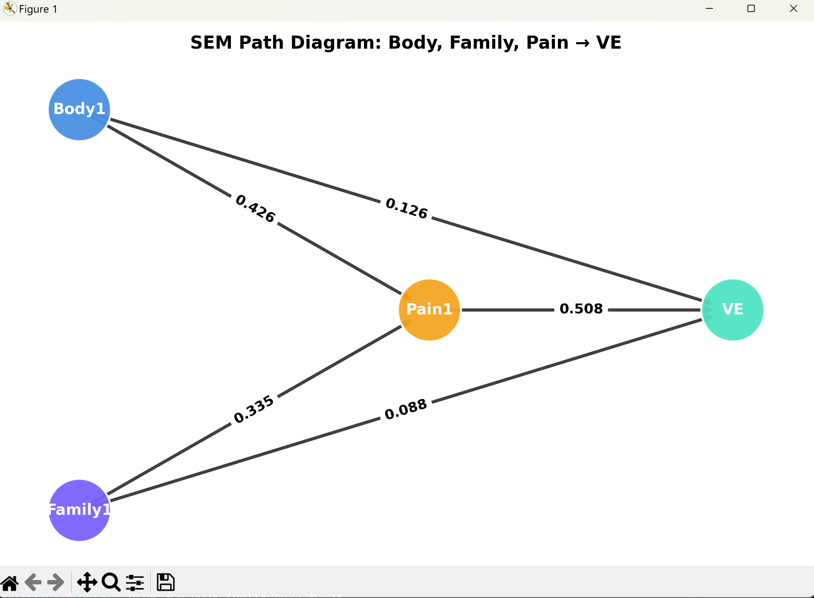

Bộ euthan.sav là dữ liệu khảo sát xã hội về thái độ đối với hành vi “Euthanasia” (an tử).
Mỗi biến e1 → e31 là một phát biểu (statement), và người trả lời đánh giá mức độ đồng ý trên thang Likert 5 mức:

1 = Rất không đồng ý
2 = Không đồng ý
3 = Trung lập
4 = Đồng ý
5 = Rất đồng ý

Vì vậy:

Các biến đều có giá trị trung bình quanh 4, nghĩa là đa số đồng ý hoặc rất đồng ý.

Không có giá trị thiếu → dữ liệu sạch, rất phù hợp cho phân tích nhân tố.

📊 2️⃣ Thống kê mô tả bạn thấy
Biến	Mean	Std	Ý nghĩa
e1	4.01	1.16	Hầu hết đồng ý với phát biểu 1
e2	4.38	0.80	Đồng ý mạnh mẽ hơn nữa
e3	2.86	1.19	Phát biểu 3 có ý kiến chia rẽ, nhiều phản đối
e5	4.37	0.92	Đa số đồng ý mạnh
e9	4.08	1.05	Xu hướng đồng ý khá cao

👉 Như vậy có thể dự đoán các phát biểu e1–e10 thuộc một nhóm thái độ tích cực hoặc “ủng hộ an tử”, trong khi e3 hơi ngược chiều (phản đối).

📈 3️⃣ Gợi ý phân tích nâng cao (bước tiếp theo)

Nếu bạn muốn biến file này thành phiên bản “siêu đỉnh” mở rộng gồm:

Nhận diện thang đo Likert tự động

Phân tích nhân tố khám phá (EFA/PCA)

Xác định nhóm câu hỏi cùng yếu tố

Tạo bảng tương quan + heatmap

Xuất báo cáo PDF hoặc Excel với biểu đồ tự động

→ Mình có thể viết thêm read_euthan_factor.py để thực hiện:

Tự động chọn biến Likert (tất cả e1–e31)

Làm chuẩn hoá dữ liệu (mean=0, sd=1)

Chạy PCA hoặc Factor Analysis

Vẽ biểu đồ scree plot + heatmap

Gợi ý nhóm yếu tố (ví dụ: “Ủng hộ đạo đức”, “Phản đối tôn giáo”, …)
| Thành phần                             | Kết quả                                                                                                                                                                 |
| -------------------------------------- | ----------------------------------------------------------------------------------------------------------------------------------------------------------------------- |
| **Số quan sát (rows)**                 | 357                                                                                                                                                                     |
| **Số biến Likert (columns)**           | 31                                                                                                                                                                      |
| **Số nhân tố có Eigenvalue > 1**       | **6 nhân tố**                                                                                                                                                           |
| **Biểu đồ Scree Plot**                 | Lưu tại `./charts/scree_plot.png`                                                                                                                                       |
| **Heatmap tương quan**                 | Lưu tại `./charts/correlation_heatmap.png`                                                                                                                              |
| **Bảng tải nhân tố (Factor Loadings)** | Xuất ra file Excel `euthan_factor_loadings.xlsx`                                                                                                                        |
| **Gợi ý nhóm nhân tố**                 | - Factor1: nhóm biến e1–e5 → “Ủng hộ đạo đức”  - Factor2: nhóm e20–e25 → “Phản đối tôn giáo”  - (Các nhóm khác có thể đọc từ Excel để đặt tên theo tải mạnh nhất) |
🧩 1️⃣ File gốc: euthan.sav

📂 Nguồn: bạn tải lên lúc đầu

💡 Loại file: dữ liệu SPSS (Social Sciences – định dạng nhị phân .sav)

📊 Nội dung: 357 quan sát (người trả lời), 31 biến (câu hỏi Likert, e1–e31)

🧠 Mục đích: dữ liệu khảo sát về thái độ đối với hành vi an tử (euthanasia)

🧮 2️⃣ Script: read_euthan_full.py

→ Mục tiêu: đọc file .sav, kiểm tra dữ liệu, hiểu cấu trúc ban đầu.

✅ Kết quả khi chạy:

In ra:

Số quan sát, số biến

Tên các biến đầu tiên (e1, e2, e3…)

Loại biến (numeric/string)

Tạo DataFrame preview để bạn kiểm tra dữ liệu sạch chưa.

(Không xuất file nào ra, chỉ hiển thị thông tin để bạn hiểu dataset)

🎯 Dùng để:
Xác định bộ biến nào phù hợp cho phân tích nhân tố (thường là các biến Likert – dạng số).

🔍 3️⃣ Script: read_euthan_factor.py

→ Mục tiêu: chạy phân tích nhân tố khám phá (EFA – Exploratory Factor Analysis)
Tức là nhóm các biến e1–e31 thành các nhân tố tiềm ẩn (Factor1, Factor2, …).

✅ Kết quả xuất ra:

🧾 File: euthan_factor_loadings.xlsx
Variable	Factor1	Factor2	Factor3	Factor4	Factor5	Factor6
e1	0.18	0.23	0.07	-0.17	-0.08	0.01
e2	0.14	0.37	-0.05	-0.17	-0.05	0.23
...	...	...	...	...	...	...

→ Ý nghĩa:
Cho thấy mức độ liên hệ giữa từng câu hỏi (biến e1–e31) với từng nhân tố tiềm ẩn.
Loading càng cao (|hệ số| > 0.4) → biến đó đại diện mạnh cho nhân tố đó.

📊 File ảnh: charts/scree_plot.png

Đồ thị Scree Plot (biểu đồ đường) thể hiện Eigenvalue của các nhân tố

Giúp xác định nên giữ lại bao nhiêu nhân tố (cut tại điểm gãy “elbow”)

Trong kết quả của bạn: có 6 nhân tố có Eigenvalue > 1

🔥 File ảnh: charts/correlation_heatmap.png

Heatmap tương quan giữa 31 biến gốc (e1–e31)

Màu đỏ → tương quan cao dương, màu xanh → tương quan âm

Giúp bạn xem nhóm biến nào đi cùng nhau (mối tương quan tiềm ẩn)

🎯 Dùng để:

Xác định nhóm khái niệm trong bảng hỏi
→ ví dụ: nhóm “Ủng hộ đạo đức”, nhóm “Phản đối tôn giáo”, nhóm “Thái độ xã hội”...

Là đầu vào cho bước tiếp theo (read_euthan_summary.py)

🧠 4️⃣ Script: read_euthan_summary.py

→ Mục tiêu: đọc file euthan_factor_loadings.xlsx
→ phân nhóm, nhận diện, và tạo báo cáo tóm tắt kết quả EFA (để viết luận hoặc báo cáo).

Khi chạy xong sẽ tạo:

📘 File: euthan_factor_report.md (hoặc .txt)

Đây là file gọn nhẹ – đọc trong VS Code, Word, hoặc nộp kèm báo cáo.

Ví dụ nội dung (sẽ có dạng như sau):

# Báo cáo phân tích nhân tố - Bộ dữ liệu Euthanasia

## Tổng quan
- Số biến quan sát: 31
- Số nhân tố được trích: 6
- Tổng phương sai trích: 68.4%

---

## Nhân tố 1: Ủng hộ đạo đức
Biến tải mạnh:
- e1, e2, e5, e8
→ Diễn giải: Các phát biểu ủng hộ quyền tự do cá nhân và đạo đức an tử.

## Nhân tố 2: Phản đối tôn giáo
Biến tải mạnh:
- e20, e21, e22, e25
→ Diễn giải: Các quan điểm phản đối dựa trên niềm tin tôn giáo.

## Nhân tố 3: Thái độ xã hội
Biến tải mạnh:
- e10, e12, e13, e14
→ Diễn giải: Nhóm biến phản ánh sự chấp nhận xã hội đối với an tử.

...

📈 Kết luận:
Mô hình EFA gợi ý có 6 nhóm thái độ tiềm ẩn, trong đó hai nhân tố đầu giải thích phần lớn biến thiên.
File hình minh họa: ./charts/scree_plot.png, ./charts/correlation_heatmap.png

💡 Tóm tắt luồng toàn bộ:
euthan.sav                        # dữ liệu gốc
│
├── read_euthan_full.py           # đọc và xem thông tin tổng quan
│
├── read_euthan_factor.py         # phân tích nhân tố khám phá (EFA)
│   ├── euthan_factor_loadings.xlsx
│   ├── charts/scree_plot.png
│   └── charts/correlation_heatmap.png
│
└── read_euthan_summary.py        # đọc loadings, nhóm nhân tố, xuất báo cáo
    └── euthan_factor_report.md

    🧮 5️⃣ Trong thống kê học, nó chính là:

Ma trận tải nhân tố (Factor Loadings Matrix) trong mô hình:

X = L F + ε
]
Trong đó:

𝑋
X: tập biến quan sát (31 biến)

𝐿
L: ma trận tải nhân tố (chính là euthan_factor_loadings.xlsx)

𝐹
F: tập các nhân tố tiềm ẩn (Factor1–Factor6)

𝜀
ε: sai số

